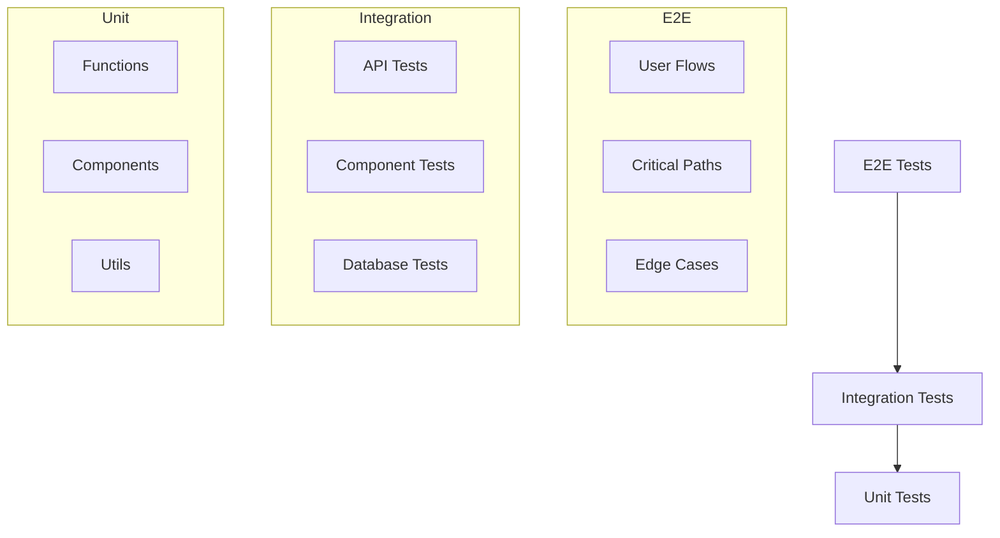

# Testing Strategy Tutorial

> **Difficulty Level**: Intermediate
> **Prerequisites**: Basic JavaScript/TypeScript, React fundamentals
> **Version**: Jest 29+, React Testing Library 13+, Cypress 12+

## Quick Reference

```typescript
// Unit test (Jest + React Testing Library)
describe('Component', () => {
  it('renders correctly', () => {
    render(<Component prop="value" />);
    expect(screen.getByText('Expected text')).toBeInTheDocument();
  });
});

// API test
describe('API', () => {
  it('returns data', async () => {
    const { req, res } = createMocks({ method: 'GET' });
    await handler(req, res);
    expect(res._getStatusCode()).toBe(200);
  });
});

// E2E test (Cypress)
describe('User flow', () => {
  it('completes registration', () => {
    cy.visit('/register');
    cy.get('input[name="email"]').type('user@example.com');
    cy.get('button[type="submit"]').click();
    cy.url().should('include', '/dashboard');
  });
});
```

## Overview

This tutorial explains how we test our application to ensure it works correctly and reliably. We use a combination of different testing approaches to cover all aspects of our application.

> **Related Documents:**
>
> - [Testing Strategy](../../pm/testing-strategy.md) - Overall testing approach and priorities
> - [Testing Standards](../standards/testing-standards.md) - Detailed testing standards and requirements
> - [Test Checklist](../../pm/test-checklist.md) - Checklist for test coverage

## Testing Pyramid



## Testing Levels

### 1. Unit Tests

Unit tests are the foundation of our testing strategy. They test individual pieces of code in isolation.

**What we test:**

- Individual functions
- React components
- Utility functions
- Database operations

**Example:**

```typescript
// src/utils/formatDate.test.ts
import { formatDate } from './formatDate';

describe('formatDate', () => {
  it('formats date correctly', () => {
    const date = new Date('2024-03-20');
    expect(formatDate(date)).toBe('20 March 2024');
  });
});

// src/components/Button.test.tsx
import { render, fireEvent } from '@testing-library/react';
import { Button } from './Button';

describe('Button', () => {
  it('handles click events', () => {
    const handleClick = jest.fn();
    const { getByText } = render(<Button onClick={handleClick}>Click me</Button>);

    fireEvent.click(getByText('Click me'));
    expect(handleClick).toHaveBeenCalled();
  });
});
```

### 2. Integration Tests

Integration tests verify that different parts of our application work together correctly.

**What we test:**

- API routes
- Database operations
- Component interactions
- Data flow

**Example:**

```typescript
// src/pages/api/events/[eventId].test.ts
import { createMocks } from 'node-mocks-http';
import handler from './[eventId]';
import { prisma } from '@/lib/prisma';

describe('Event API', () => {
  it('creates a new event', async () => {
    const { req, res } = createMocks({
      method: 'POST',
      body: {
        name: 'Test Event',
        startDate: new Date(),
      },
    });

    await handler(req, res);
    expect(res._getStatusCode()).toBe(201);

    const event = await prisma.event.findFirst({
      where: { name: 'Test Event' },
    });
    expect(event).toBeTruthy();
  });
});
```

### 3. End-to-End (E2E) Tests

E2E tests simulate real user interactions with our application.

**What we test:**

- Complete user flows
- Critical paths
- Edge cases
- User interactions

**Example:**

```typescript
// cypress/e2e/visitor-registration.cy.ts
describe('Visitor Registration', () => {
  it('completes registration flow', () => {
    cy.visit('/visitors/new');

    // Fill in form
    cy.get('input[name="firstName"]').type('John');
    cy.get('input[name="lastName"]').type('Doe');
    cy.get('input[name="email"]').type('john@example.com');

    // Select touchpoint
    cy.get('select[name="touchpoint"]').select('SOCIAL_MEDIA');
    cy.get('select[name="source"]').select('FACEBOOK');

    // Submit form
    cy.get('button[type="submit"]').click();

    // Verify success
    cy.url().should('include', '/visitors');
    cy.contains('John Doe').should('exist');
  });
});
```

## Testing Tools

### 1. Jest

- JavaScript testing framework
- Used for unit and integration tests
- Built into Next.js

### 2. React Testing Library

- Testing React components
- Encourages testing from user's perspective
- Great for accessibility testing

### 3. Cypress

- E2E testing framework
- Real browser testing
- Great developer experience

### 4. MSW (Mock Service Worker)

- API mocking
- Network request interception
- Testing edge cases

## Test Organization

```
src/
├── __tests__/           # Test files
│   ├── unit/           # Unit tests
│   ├── integration/    # Integration tests
│   └── utils/          # Test utilities
├── components/         # React components
├── pages/             # Next.js pages
└── utils/             # Utility functions

cypress/
├── e2e/               # E2E test files
├── fixtures/          # Test data
└── support/           # Cypress support files
```

## Running Tests

```bash
# Run all tests
npm test

# Run specific test file
npm test -- src/__tests__/unit/Button.test.tsx

# Run E2E tests
npm run cypress:open

# Run tests with coverage
npm run test:coverage
```

## Best Practices

1. **Test Organization**

   - Group related tests
   - Use descriptive test names
   - Follow the "test pyramid"

2. **Test Coverage**

   - Aim for 80% coverage
   - Focus on critical paths
   - Test edge cases

3. **Test Maintenance**

   - Keep tests simple
   - Avoid duplication
   - Update tests with code changes

4. **Performance**
   - Mock external services
   - Use test databases
   - Optimize test runs

## Common Testing Patterns

### 1. Component Testing

```typescript
// Testing component rendering
it('renders correctly', () => {
  const { container } = render(<MyComponent />);
  expect(container).toMatchSnapshot();
});

// Testing user interactions
it('handles user input', () => {
  const { getByRole } = render(<MyComponent />);
  const input = getByRole('textbox');
  fireEvent.change(input, { target: { value: 'test' } });
  expect(input).toHaveValue('test');
});
```

### 2. API Testing

```typescript
// Testing API responses
it('returns correct data', async () => {
  const { data } = await fetch('/api/events');
  expect(data).toHaveLength(5);
});

// Testing error cases
it('handles errors', async () => {
  const response = await fetch('/api/events/invalid');
  expect(response.status).toBe(404);
});
```

### 3. Database Testing

```typescript
// Testing database operations
it('creates record', async () => {
  const user = await prisma.user.create({
    data: { name: 'Test User' },
  });
  expect(user.name).toBe('Test User');
});

// Testing relationships
it('creates related records', async () => {
  const event = await prisma.event.create({
    data: {
      name: 'Test Event',
      registrations: {
        create: { userId: '123' },
      },
    },
  });
  expect(event.registrations).toHaveLength(1);
});
```

## Troubleshooting

### Common Testing Issues

| Issue                                            | Solution                                                  |
| ------------------------------------------------ | --------------------------------------------------------- |
| Tests are flaky (sometimes pass, sometimes fail) | Add proper cleanup, avoid test interdependence            |
| Tests are slow                                   | Mock external dependencies, use test databases            |
| Difficult to test certain components             | Refactor for better testability, use dependency injection |
| Test coverage is low                             | Start with critical paths, gradually increase coverage    |

### Debugging Tips

```typescript
// Debug test output
screen.debug(); // In React Testing Library

// Force test to pause
await new Promise(resolve => setTimeout(resolve, 5000));

// Log element state in Cypress
cy.get('element').then($el => {
  console.log($el.text());
});
```

## Test Coverage Checklist

- [ ] Critical user flows have E2E tests
- [ ] API endpoints have integration tests
- [ ] UI components have unit tests
- [ ] Edge cases and error states are tested
- [ ] Authentication and authorization are tested
- [ ] Form validation is tested
- [ ] Accessibility is tested

## Related Tutorials

- [Component Testing](./component-testing.md)
- [API Testing](./api-testing.md)
- [Test-Driven Development](./tdd-approach.md)

## Further Reading

1. **Testing Fundamentals**

   - [Jest Documentation](https://jestjs.io/docs/getting-started)
   - [React Testing Library](https://testing-library.com/docs/react-testing-library/intro/)
   - [Cypress Documentation](https://docs.cypress.io/)

2. **Testing Patterns**

   - [Testing React Components](https://reactjs.org/docs/testing.html)
   - [API Testing Best Practices](https://www.mwrinfosecurity.com/our-thinking/15-security-guidelines-for-protecting-web-apis/)
   - [Database Testing](https://www.prisma.io/docs/guides/testing)

3. **Advanced Topics**
   - [Test-Driven Development](https://www.agilealliance.org/glossary/tdd/)
   - [Continuous Integration](https://www.atlassian.com/continuous-delivery/principles/continuous-integration-vs-delivery-vs-deployment)
   - [Performance Testing](https://web.dev/performance-testing/)

## Keywords

Testing, Jest, React Testing Library, Cypress, unit tests, integration tests, E2E tests, test coverage, mocking, assertions, TDD
