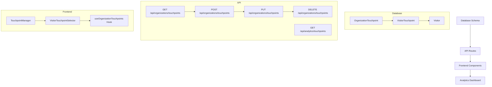

# Touchpoint System Tutorial

## Overview

The touchpoint system helps track how visitors find out about your church. It's like asking "How did you hear about us?" but in a more structured way. This tutorial explains how we built this feature from scratch.

## System Architecture



## Step-by-Step Implementation

### 1. Database Schema (prisma/schema.prisma)

First, we defined how our data will be stored in the database:

```prisma
model OrganizationTouchpoint {
  id             String       @id @default(cuid())
  organizationId String
  type           String       // e.g., "SOCIAL_MEDIA", "EVENT"
  source         String       // e.g., "FACEBOOK", "INSTAGRAM"
  label          String       // Display label
  isActive       Boolean      @default(true)
  organization   Organization @relation(fields: [organizationId], references: [id])
  touchpoints    VisitorTouchpoint[]
}

model VisitorTouchpoint {
  id          String   @id @default(cuid())
  visitorId   String
  organizationId String
  touchpoint  String   // e.g., "SOCIAL_MEDIA"
  source      String?  // e.g., "FACEBOOK"
  visitor     Visitor  @relation(fields: [visitorId], references: [id])
  organizationTouchpoint OrganizationTouchpoint?
}
```

**Key Concepts:**

- Database Relations: How different tables connect to each other
- Prisma Schema: A way to define your database structure
- CUID: A unique identifier for database records

### 2. API Routes

We created two main API routes:

1. **Organization Touchpoints API** (`/api/organizations/[organizationId]/touchpoints`):

   - GET: Fetch all touchpoints for an organization
   - POST: Create a new touchpoint
   - PUT: Update an existing touchpoint
   - DELETE: Remove a touchpoint

2. **Analytics API** (`/api/analytics/touchpoints`):
   - GET: Fetch analytics data about touchpoints

**Key Concepts:**

- REST API: A way to interact with your backend
- HTTP Methods: Different ways to handle data (GET, POST, PUT, DELETE)
- API Routes: Next.js way of creating API endpoints

### 3. Frontend Components

We created three main components:

1. **TouchpointManager** (`src/components/organization/TouchpointManager.tsx`):

   - Allows admins to manage touchpoints
   - CRUD operations for touchpoints
   - Table view of all touchpoints

2. **VisitorTouchpointSelector** (`src/components/visitor/VisitorTouchpointSelector.tsx`):

   - Used in visitor registration form
   - Two-step selection (type then source)
   - Dynamic options based on organization settings

3. **useOrganizationTouchpoints Hook** (`src/hooks/useOrganizationTouchpoints.ts`):
   - Custom hook to fetch touchpoints
   - Handles loading and error states
   - Caches data using SWR

**Key Concepts:**

- React Components: Reusable UI elements
- Custom Hooks: Reusable logic in React
- SWR: Data fetching and caching library

### 4. Analytics Dashboard

The analytics dashboard (`/analytics/touchpoints`) shows:

- Total visitors
- Touchpoint distribution
- Source distribution
- Monthly trends

**Key Concepts:**

- Data Visualization: Using charts to show data
- Recharts: A charting library for React
- Responsive Design: Making UI work on all screen sizes

## Testing Strategy

### Unit Tests

- Test individual components
- Test API routes
- Test database operations

### Integration Tests

- Test component interactions
- Test API integrations
- Test data flow

### E2E Tests

- Test complete user flows
- Test real-world scenarios
- Test edge cases

## Further Reading

1. **Database & ORM**

   - [Prisma Documentation](https://www.prisma.io/docs/)
   - [PostgreSQL Tutorial](https://www.postgresqltutorial.com/)
   - [Database Design Basics](https://www.lucidchart.com/pages/database-diagram/database-design)

2. **API Development**

   - [REST API Design](https://restfulapi.net/)
   - [Next.js API Routes](https://nextjs.org/docs/api-routes/introduction)
   - [HTTP Methods](https://developer.mozilla.org/en-US/docs/Web/HTTP/Methods)

3. **Frontend Development**

   - [React Components](https://reactjs.org/docs/components-and-props.html)
   - [Custom Hooks](https://reactjs.org/docs/hooks-custom.html)
   - [SWR Documentation](https://swr.vercel.app/)

4. **Testing**
   - [Jest Documentation](https://jestjs.io/docs/getting-started)
   - [React Testing Library](https://testing-library.com/docs/react-testing-library/intro/)
   - [Cypress Documentation](https://docs.cypress.io/)

## Common Questions

1. **Why use Prisma?**

   - Type safety
   - Auto-generated database client
   - Easy migrations
   - Great developer experience

2. **Why use SWR?**

   - Automatic caching
   - Real-time updates
   - Error handling
   - Loading states

3. **Why separate OrganizationTouchpoint and VisitorTouchpoint?**
   - OrganizationTouchpoint: Defines available options
   - VisitorTouchpoint: Records visitor selections
   - Allows for analytics and reporting

## Adding More Features

The system is designed to be extensible. You can:

1. Add new touchpoint types
2. Create custom reports
3. Add more analytics
4. Integrate with other systems

## Troubleshooting

Common issues and solutions:

1. Database connection issues
2. API route errors
3. Component rendering problems
4. Analytics data discrepancies
