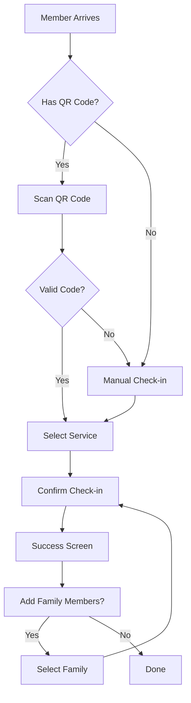
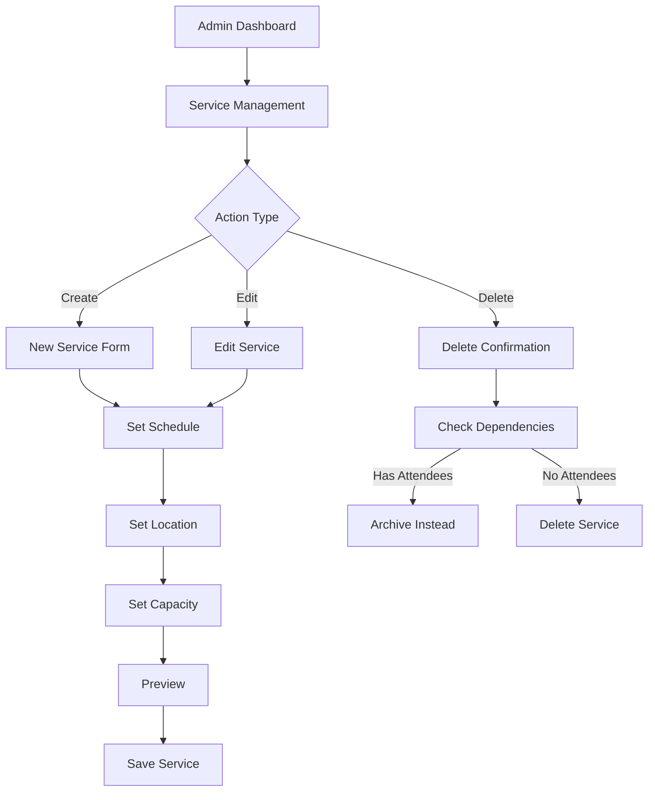
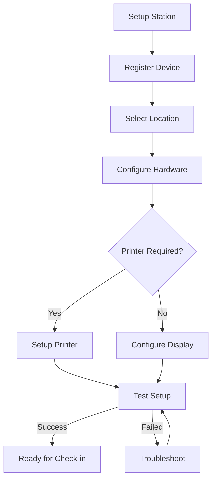
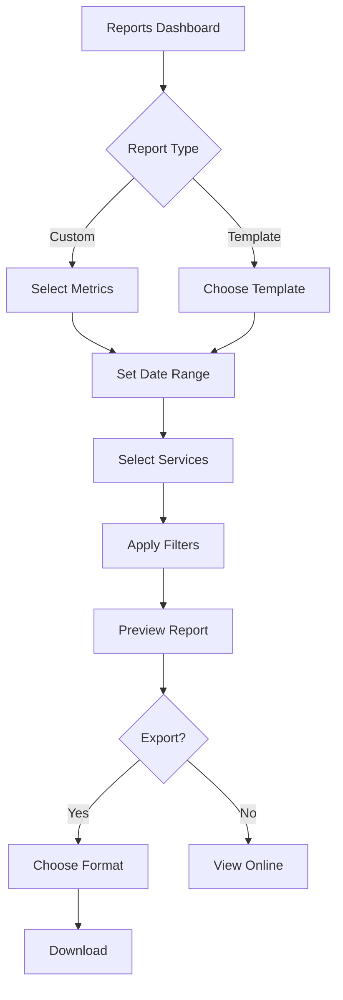
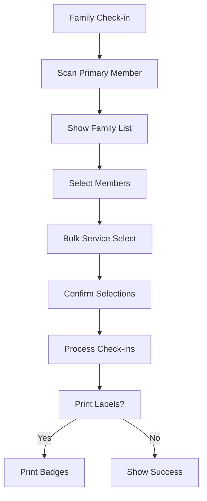
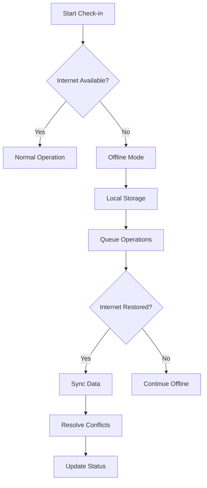
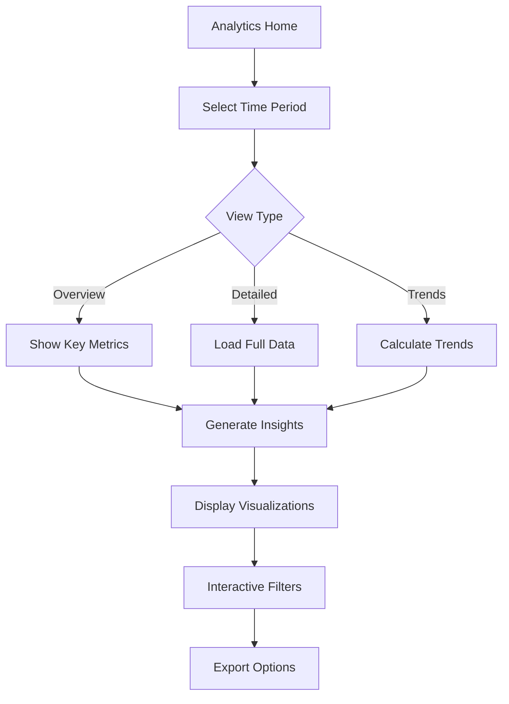
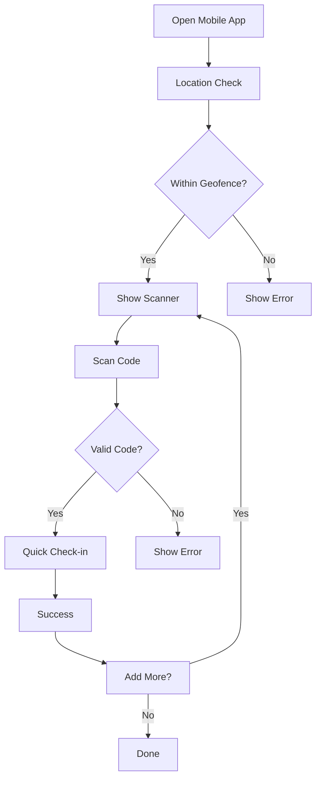

# Attendance System Specification

## Overview

The attendance tracking system is a core component of ChMS Africa, designed to handle both service and class attendance with support for family check-ins.

## Technical Implementation

### Schema Design

```prisma
model Organization {
  id          String    @id @default(cuid())
  name        String
  locations   Location[]
  services    Service[]
  members     Member[]
  createdAt   DateTime  @default(now())
  updatedAt   DateTime  @updatedAt
}

model Location {
  id          String    @id @default(cuid())
  name        String
  orgId       String
  org         Organization @relation(fields: [orgId], references: [id])
  services    Service[]
}

model Service {
  id          String    @id @default(cuid())
  name        String
  locationId  String
  location    Location  @relation(fields: [locationId], references: [id])
  checkIns    CheckIn[]
  startTime   DateTime
  endTime     DateTime
  qrCode      String?   // Current service QR code
}

model Member {
  id          String    @id @default(cuid())
  name        String
  email       String?   @unique
  orgId       String
  org         Organization @relation(fields: [orgId], references: [id])
  checkIns    CheckIn[]
  role        Role      @default(MEMBER)
}

model CheckIn {
  id          String    @id @default(cuid())
  memberId    String
  member      Member    @relation(fields: [memberId], references: [id])
  serviceId   String
  service     Service   @relation(fields: [serviceId], references: [id])
  timestamp   DateTime  @default(now())
  method      CheckInMethod
}

enum Role {
  SUPER_ADMIN
  ADMIN
  MANAGER
  STAFF
  VIEWER
}

enum CheckInMethod {
  QR_SCAN
  MANUAL
}
```

## Core Features

### 1. Service Attendance

- QR code-based check-in
- Manual entry option
- Offline capability
- Location verification
- Family check-in support (future)

### 2. Class Attendance

- Multiple class types support
- Session management
- Attendance tracking
- Student enrollment tracking

### 3. Family Management

- Family registration
- Child linking
- Family unit tracking
- Future: Single scan for multiple members

## Implementation Phases

### Phase 1: Core Check-in System (Completed)

- [x] Basic Project Setup

  - [x] Next.js initialization
  - [x] TypeScript configuration
  - [x] ESLint + Prettier
  - [x] Chakra UI integration
  - [x] Authentication setup
  - [x] PostgreSQL setup
  - [x] Basic seed data
  - [x] Vercel deployment

- [x] Service QR System
  - [x] QR generation
  - [x] Display components
  - [x] Animation system
  - [x] Manual input system
  - [x] Recent check-ins display

### Phase 2: Mobile Authentication (In Progress)

- [x] Mobile PWA Foundation
  - [x] Service worker
  - [x] Offline caching
  - [x] SSO Implementation
  - [ ] Session management

### Phase 3-6: Enhanced Features (In Progress)

- [x] Admin dashboard
- [x] Organization setup
- [ ] Advanced features
- [ ] Polish & launch

## Technical Standards

### Performance Targets

- First contentful paint < 1.5s
- Time to interactive < 2s
- Animation frame rate > 55fps

### Security

- OWASP compliance
- Rate limiting
- CSRF protection
- XSS prevention

### Accessibility

- WCAG 2.1 Level AA
- Keyboard navigation
- Screen reader support
- High contrast support

## Monitoring & Logging

### Performance Monitoring

```typescript
// Implementation in lib/monitoring.ts
export const performanceMonitor = {
  start: (label: string) => {
    const start = performance.now();
    return () => {
      const duration = performance.now() - start;
      logger.info({ type: 'performance', label, duration });
      return duration;
    };
  },
};
```

### Error Tracking

```typescript
export const trackError = (error: Error, context: Record<string, any> = {}) => {
  logger.error({
    error: {
      message: error.message,
      stack: error.stack,
      ...context,
    },
  });
  Sentry.captureException(error, { extra: context });
};
```

### Usage Analytics

```typescript
export const trackEvent = (eventName: string, properties: Record<string, any> = {}) => {
  logger.info({
    type: 'event',
    event: eventName,
    ...properties,
  });
};
```

## Feature Flags

```typescript
export const features = {
  CHECK_IN: {
    QR_SCANNING: true,
    MANUAL_ENTRY: true,
    GEOFENCING: false, // Future feature
    FACIAL_RECOGNITION: false,
  },
  NOTIFICATIONS: {
    EMAIL: true,
    PUSH: false, // Phase 2
    SMS: false, // Future feature
  },
};
```

## Success Metrics (Updated Targets)

### Technical

- Page load time < 1.5s (Updated from 2s)
- API response time < 150ms (Updated from 200ms)
- Test coverage > 85% (Updated from 80%)
- Zero critical bugs
- 99.95% uptime (Updated from 99.9%)

### User Experience

- < 3 clicks for check-in
- < 5s for report generation
- Zero data loss
- Intuitive interface
- Mobile responsiveness

## Pages and Features

### 1. Service Check-in Dashboard (/check-in)

- Live QR code display (rotating codes for security)
- Manual check-in form (fallback option)
- Recent check-ins list (real-time updates)
- Quick stats (today's attendance)
- Service selector (switch between active services)
- Offline mode indicator
- Family check-in support

### 2. Attendance Overview (/attendance)

- Attendance metrics dashboard
- Service attendance comparison
- Trend analysis
- Member attendance patterns
- Export functionality
- Date range filtering
- Location filtering

### 3. Service Management (/services)

- Service schedule management
- Service type configuration
- Location assignment
- Time slot management
- Recurring service setup
- Capacity planning
- Service categories

### 4. Check-in Station Setup (/check-in/setup)

- Device registration
- QR scanner configuration
- Printer setup
- Offline mode settings
- Station location assignment
- Access control settings
- Network status monitoring

### 5. Attendance Reports (/reports)

- Customizable report builder
- Preset report templates
- Statistical analysis
- Attendance trends
- Member participation
- Service comparison
- Export options (PDF, CSV, Excel)

### 6. Member Attendance Profile (/members/[id]/attendance)

- Individual attendance history
- Attendance streak tracking
- Service participation summary
- Absence patterns
- Notes and comments
- Communication preferences
- Family attendance linking

### 7. Mobile Check-in (/m/check-in)

- QR code scanner
- Location verification
- Quick check-in flow
- Offline capability
- Family check-in
- Recent check-in confirmation
- Error handling

### 8. Admin Dashboard (/admin/attendance)

- System health monitoring
- User activity logs
- Configuration settings
- Data management
- Access control
- Audit trails
- Backup/restore options

### 9. Analytics Dashboard (/analytics/attendance)

- Advanced metrics
- Custom reports
- Growth trends
- Retention analysis
- Service performance
- Location insights
- Predictive analytics

### 10. Settings (/settings/attendance)

- Check-in rules
- Notification preferences
- Report configurations
- Integration settings
- Data retention policies
- Privacy settings
- System preferences

## User Flows

### 1. Regular Member Check-in Flow



### 2. Admin Service Management Flow



### 3. Check-in Station Setup Flow



### 4. Attendance Report Generation Flow



### 5. Family Check-in Flow



### 6. Offline Mode Operation Flow



### 7. Analytics Dashboard Flow



### 8. Mobile Check-in Flow


